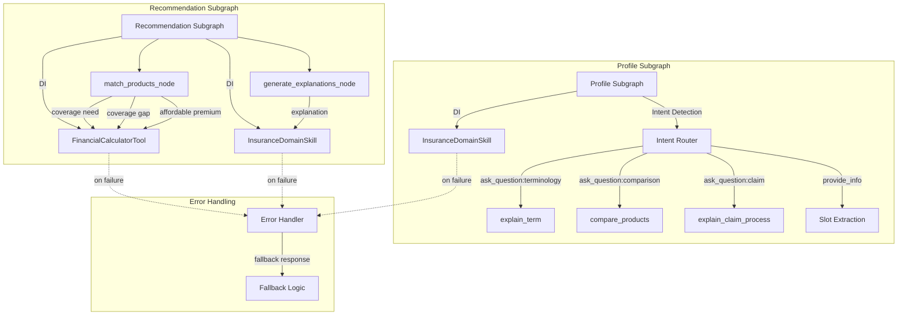
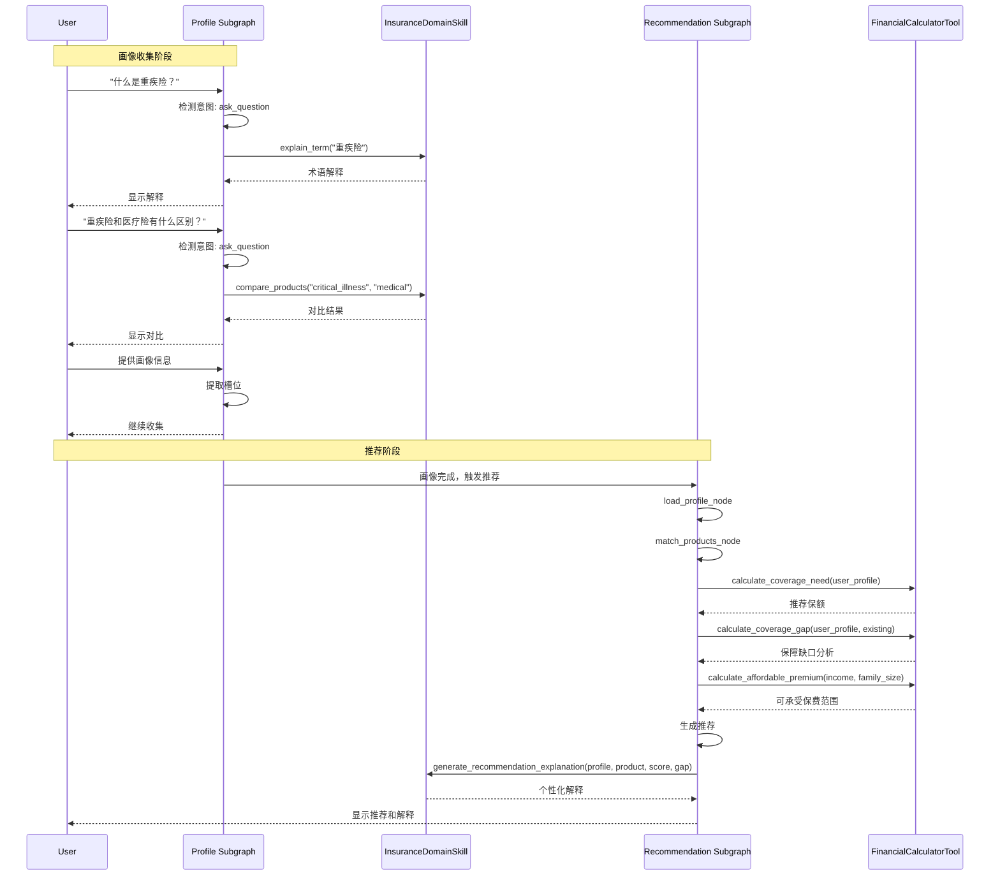
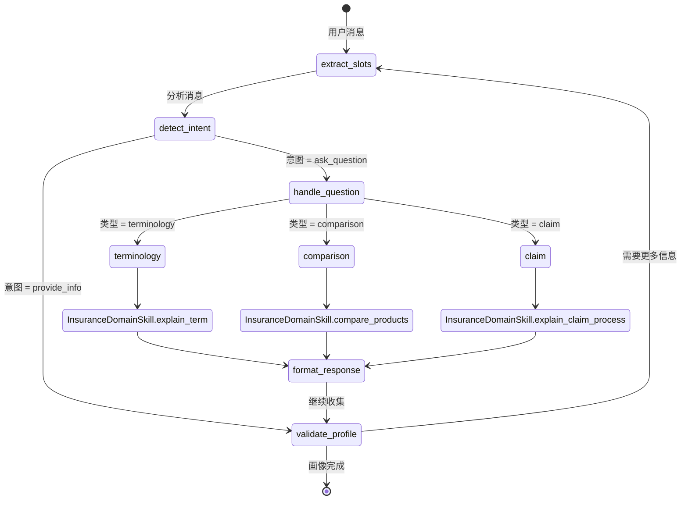

# 设计文档: Skills和Tools集成

## 概述

本文档描述将`InsuranceDomainSkill`和`FinancialCalculatorTool`集成到Profile Subgraph和Recommendation Subgraph的设计。该集成实现：

1. **Profile Subgraph** 在画像收集过程中回答用户关于保险术语、产品对比和理赔流程的问题
2. **Recommendation Subgraph** 使用金融计算进行保障缺口分析和保费可承受性评估
3. **Recommendation Subgraph** 使用领域知识生成个性化推荐解释

### 核心目标

1. **无缝集成**: Skills和Tools干净地集成到现有子图架构中
2. **依赖注入**: Skills和Tools通过工厂函数注入以提高可测试性
3. **优雅降级**: 当Skills/Tools失败时系统继续运行
4. **清晰分离**: 领域知识（Skills）和计算（Tools）保持独立关注点

### 技术栈

- **Skills**: `InsuranceDomainSkill` - 保险术语、产品对比、理赔流程的领域知识模块
- **Tools**: `FinancialCalculatorTool` - 保费可承受性、保障需求和缺口分析的计算模块
- **Subgraphs**: Profile Subgraph和Recommendation Subgraph (LangGraph 1.0.0)
- **集成模式**: 通过工厂函数参数进行依赖注入

## 架构

### 集成架构图



### 组件交互流程



## 组件和接口

### InsuranceDomainSkill接口

`InsuranceDomainSkill`为Profile和Recommendation子图提供领域知识能力。

```python
# skills/insurance_domain.py (已存在)

class InsuranceDomainSkill:
    """保险领域知识技能"""
    
    def __init__(self, terminology_path: Optional[str] = None):
        """使用可选的自定义术语路径初始化"""
        ...
    
    def explain_term(self, term: str) -> str:
        """
        解释保险术语。
        
        Args:
            term: 要解释的术语（如"重疾险"、"等待期"）
            
        Returns:
            格式化的解释文本，包含要点和相关术语
            
        Raises:
            不抛出异常 - 如果术语未找到则返回回退消息
        """
        ...
    
    def compare_products(self, product_type1: str, product_type2: str) -> Dict[str, Any]:
        """
        对比两种保险产品类型。
        
        Args:
            product_type1: 第一种产品类型（如"critical_illness"、"medical"）
            product_type2: 第二种产品类型
            
        Returns:
            对比结果，包含：
            - product1/product2: 产品信息
            - comparison: 维度对比列表
            - recommendation: 总体建议文本
            - error: 如果产品类型未找到的错误消息
        """
        ...
    
    def explain_claim_process(self, product_type: str) -> List[str]:
        """
        解释产品类型的理赔流程。
        
        Args:
            product_type: 产品类型（如"critical_illness"、"medical"）
            
        Returns:
            理赔流程步骤和注意事项列表
        """
        ...
    
    def generate_recommendation_explanation(
        self,
        profile_data: Dict[str, Any],
        product_data: Dict[str, Any],
        match_score: float,
        coverage_gap: Optional[Dict[str, Any]] = None
    ) -> str:
        """
        生成个性化推荐解释。
        
        Args:
            profile_data: 用户画像数据
            product_data: 产品数据
            match_score: 匹配分数（0-100）
            coverage_gap: 保障缺口分析结果
            
        Returns:
            格式化的解释文本
        """
        ...
```

### FinancialCalculatorTool接口

`FinancialCalculatorTool`为Recommendation子图提供金融计算能力。

```python
# tools/financial_calculator.py (已存在)

class FinancialCalculatorTool:
    """保险推荐金融计算工具"""
    
    DEFAULT_CONFIG = {
        "base_premium_ratio": 0.10,  # 收入的10%
        "family_size_adjustment": 0.02,
        "min_premium_ratio": 0.05,  # 5%
        "max_premium_ratio": 0.15,  # 15%
        "critical_illness_multiplier": 5,
        "medical_fixed_coverage": 500000,
        "accident_multiplier": 10,
        "life_multiplier": 10,
        "default_annual_income": 100000,
    }
    
    def __init__(self, config: Optional[Dict[str, Any]] = None):
        """使用可选的自定义配置初始化"""
        ...
    
    def calculate_affordable_premium(
        self, 
        annual_income: float, 
        family_size: int
    ) -> float:
        """
        计算可承受年保费。
        
        公式: income * (base_ratio - family_adjustment)
        范围: 收入的5-15%，根据家庭人数调整
        
        Args:
            annual_income: 年收入（人民币）
            family_size: 家庭成员数量
            
        Returns:
            每年可承受保费金额
            
        Raises:
            ValueError: 如果income < 0或family_size < 1
        """
        ...
    
    def calculate_coverage_need(self, user_profile: UserProfile) -> Dict[str, float]:
        """
        按产品类型计算推荐保额。
        
        规则:
        - 重疾险: 5倍年收入
        - 医疗险: 固定50万元
        - 意外险: 10倍年收入
        - 寿险: 有被抚养人时10倍收入，否则为0
        
        Args:
            user_profile: 用户画像模型
            
        Returns:
            各产品类型保额字典
        """
        ...
    
    def calculate_premium_to_income_ratio(
        self, 
        total_premium: float, 
        annual_income: float
    ) -> float:
        """
        计算保费收入比。
        
        Args:
            total_premium: 总年保费
            annual_income: 年收入
            
        Returns:
            比率（通常在0-1范围内）
        """
        ...
    
    def evaluate_premium_affordability(
        self, 
        total_premium: float, 
        annual_income: float,
        family_size: int = 1
    ) -> Dict[str, Any]:
        """
        评估保费是否可承受。
        
        Args:
            total_premium: 总年保费
            annual_income: 年收入
            family_size: 家庭人数
            
        Returns:
            字典，包含：
            - is_affordable: bool
            - ratio: float
            - affordable_premium: float
            - gap: float（正数=超出预算）
            - recommendation: str
        """
        ...
    
    def calculate_coverage_gap(
        self,
        user_profile: UserProfile,
        existing_coverage: Dict[str, float]
    ) -> Dict[str, Any]:
        """
        计算各产品类型的保障缺口。
        
        Args:
            user_profile: 用户画像
            existing_coverage: 产品类型到保额的字典
            
        Returns:
            字典，包含：
            - critical_illness_gap: float
            - medical_gap: float
            - accident_gap: float
            - life_gap: float
            - total_gap: float
            - priority_order: List[str]（按缺口排序的产品类型）
        """
        ...
```

### 子图集成接口

#### Profile Subgraph集成点

```python
# agents/profile_subgraph.py

from skills.insurance_domain import InsuranceDomainSkill

class ProfileSubgraphConfig(TypedDict, total=False):
    """带Skills的Profile Subgraph配置"""
    insurance_skill: Optional[InsuranceDomainSkill]

def create_profile_subgraph(
    store=None,
    insurance_skill: Optional[InsuranceDomainSkill] = None
) -> StateGraph:
    """
    创建带可选InsuranceDomainSkill注入的Profile Subgraph。
    
    Args:
        store: 用于状态持久化的PostgresStore实例
        insurance_skill: InsuranceDomainSkill实例（如果未提供则创建）
        
    Returns:
        编译后的StateGraph
    """
    # 使用提供的skill或创建默认值
    skill = insurance_skill or InsuranceDomainSkill()
    
    # 在闭包中创建带skill的节点
    async def handle_question_node(state: ProfileState) -> Dict[str, Any]:
        """使用InsuranceDomainSkill处理用户问题"""
        ...
    
    # 构建图
    builder = StateGraph(ProfileState)
    builder.add_node("handle_question", handle_question_node)
    ...
```

#### Recommendation Subgraph集成点

```python
# agents/recommendation_subgraph.py

from skills.insurance_domain import InsuranceDomainSkill
from tools.financial_calculator import FinancialCalculatorTool

class RecommendationSubgraphConfig(TypedDict, total=False):
    """带Skills/Tools的Recommendation Subgraph配置"""
    insurance_skill: Optional[InsuranceDomainSkill]
    financial_tool: Optional[FinancialCalculatorTool]

def create_recommendation_subgraph(
    store=None,
    insurance_skill: Optional[InsuranceDomainSkill] = None,
    financial_tool: Optional[FinancialCalculatorTool] = None
) -> StateGraph:
    """
    创建带可选Skills/Tools注入的Recommendation Subgraph。
    
    Args:
        store: PostgresStore实例
        insurance_skill: InsuranceDomainSkill实例（如果未提供则创建）
        financial_tool: FinancialCalculatorTool实例（如果未提供则创建）
        
    Returns:
        编译后的StateGraph
    """
    # 使用提供的实例或创建默认值
    skill = insurance_skill or InsuranceDomainSkill()
    tool = financial_tool or FinancialCalculatorTool()
    
    # 在闭包中创建带skill/tool的节点
    async def match_products_node(state: RecommendationState) -> Dict[str, Any]:
        """使用FinancialCalculatorTool匹配产品"""
        ...
    
    async def generate_explanations_node(state: RecommendationState) -> Dict[str, Any]:
        """使用InsuranceDomainSkill生成解释"""
        ...
    
    # 构建图
    builder = StateGraph(RecommendationState)
    ...
```

## 数据模型

### 意图检测模型

```python
# models/intent.py (新文件)

from enum import Enum
from typing import Optional, List
from pydantic import BaseModel

class QuestionType(str, Enum):
    """Profile Subgraph可以回答的问题类型"""
    TERMINOLOGY = "terminology"  # "什么是重疾险？"
    COMPARISON = "comparison"    # "重疾险和医疗险有什么区别？"
    CLAIM_PROCESS = "claim"      # "怎么理赔？"
    GENERAL = "general"          # 通用保险问题
    NON_INSURANCE = "non_insurance"  # 离题

class DetectedIntent(BaseModel):
    """从消息中检测到的用户意图"""
    intent_type: str  # "ask_question", "provide_info", "modify_info"等
    question_type: Optional[QuestionType] = None
    extracted_entities: dict = {}  # 如{"term": "重疾险"}, {"product_types": ["critical_illness", "medical"]}
    confidence: float = 0.0
    
    class Config:
        json_schema_extra = {
            "example": {
                "intent_type": "ask_question",
                "question_type": "terminology",
                "extracted_entities": {"term": "重疾险"},
                "confidence": 0.95
            }
        }
```

### 问题模式匹配

```python
# agents/profile_subgraph.py

# 用于意图检测的问题模式
QUESTION_PATTERNS = {
    "terminology": [
        r"什么是(.+?)\？",
        r"(.+?)是什么",
        r"解释一下(.+?)",
        r"(.+?)的意思",
    ],
    "comparison": [
        r"(.+?)和(.+?)有什么区别",
        r"(.+?)与(.+?)的区别",
        r"比较一下(.+?)和(.+?)",
        r"(.+?)好还是(.+?)好",
    ],
    "claim": [
        r"怎么理赔",
        r"理赔流程",
        r"如何申请理赔",
        r"理赔需要什么",
    ],
}

# 产品类型名称映射
PRODUCT_TYPE_NAMES = {
    "重疾险": "critical_illness",
    "重大疾病保险": "critical_illness",
    "医疗险": "medical",
    "医疗保险": "medical",
    "意外险": "accident",
    "意外伤害保险": "accident",
    "寿险": "life",
    "人寿保险": "life",
}
```

### 保障缺口结果模型

```python
# models/coverage.py (扩展现有)

from typing import Dict, List, Any
from pydantic import BaseModel

class CoverageGapResult(BaseModel):
    """FinancialCalculatorTool的保障缺口分析结果"""
    critical_illness_gap: float = 0.0
    medical_gap: float = 0.0
    accident_gap: float = 0.0
    life_gap: float = 0.0
    total_gap: float = 0.0
    priority_order: List[str] = []
    
    # 附加上下文
    current_coverage: Dict[str, float] = {}
    recommended_coverage: Dict[str, float] = {}
    
    class Config:
        json_schema_extra = {
            "example": {
                "critical_illness_gap": 300000.0,
                "medical_gap": 500000.0,
                "accident_gap": 500000.0,
                "life_gap": 1000000.0,
                "total_gap": 2300000.0,
                "priority_order": ["life", "medical", "accident", "critical_illness"],
                "current_coverage": {
                    "critical_illness": 200000.0,
                    "medical": 0.0,
                    "accident": 0.0,
                    "life": 0.0
                },
                "recommended_coverage": {
                    "critical_illness": 500000.0,
                    "medical": 500000.0,
                    "accident": 500000.0,
                    "life": 1000000.0
                }
            }
        }
```

## 正确性属性

*属性是系统所有有效执行中应保持的特征或行为——本质上是系统应该做什么的形式化陈述。属性作为人类可读规范和机器可验证正确性保证之间的桥梁。*

### 属性 1: 意图检测路由到正确的处理器

*对于任何*包含问题模式（"什么是"、"怎么理赔"、"有什么区别"）的用户消息，Profile Subgraph SHALL 将意图分类为"ask_question"并根据问题类型路由到适当的InsuranceDomainSkill方法。

**验证: Requirements 6.1, 6.2, 6.3, 6.4, 6.5**

### 属性 2: 术语解释返回有效响应

*对于任何*保险术语查询，`explain_term`方法 SHALL 返回非空字符串。如果术语存在于术语数据中，响应 SHALL 包含术语名称和定义。

**验证: Requirements 1.1, 4.1**

### 属性 3: 产品对比返回结构化结果

*对于任何*两个有效产品类型，`compare_products`方法 SHALL 返回包含`product1`、`product2`、`comparison`和`recommendation`字段的对比结果。对于无效产品类型，结果 SHALL 包含`error`和`available_types`字段。

**验证: Requirements 1.2, 4.2**

### 属性 4: 理赔流程返回步骤列表

*对于任何*有效产品类型，`explain_claim_process`方法 SHALL 返回非空的理赔流程步骤列表。对于无效产品类型，结果 SHALL 包含带可用类型的回退消息。

**验证: Requirements 1.3, 4.3**

### 属性 5: 保障缺口计算保持不变量

*对于任何*用户画像和已有保障字典，`calculate_coverage_gap`方法 SHALL 返回非负缺口值，每个缺口等于`max(0, recommended - existing)`。`total_gap` SHALL 等于所有单独缺口之和。结果 SHALL 包含`critical_illness_gap`、`medical_gap`、`accident_gap`、`life_gap`、`total_gap`和`priority_order`字段。

**验证: Requirements 2.1, 2.2, 7.1, 7.2, 7.3, 7.5**

### 属性 6: 保费可承受性在范围内

*对于任何*年收入和家庭人数，`calculate_affordable_premium`方法 SHALL 返回年收入5-15%范围内的保费金额。更大的家庭规模 SHALL 导致更低或相等的保费比例。

**验证: Requirements 2.3, 8.1, 8.2**

### 属性 7: 可承受性评估返回完整结果

*对于任何*总保费、年收入和家庭人数，`evaluate_premium_affordability`方法 SHALL 返回包含`is_affordable`（bool）、`ratio`（float）、`affordable_premium`（float）、`gap`（float）和`recommendation`（string）字段的字典。`is_affordable`值 SHALL 与`gap`的符号一致（负gap表示可承受）。

**验证: Requirements 2.4, 8.4, 8.5**

### 属性 8: 依赖注入保持行为

*对于任何*使用注入的Skills或Tools创建的子图，子图 SHALL 使用注入的实例进行所有操作。当未提供实例时，子图 SHALL 创建默认实例。

**验证: Requirements 5.1, 5.2, 5.3, 5.6**

### 属性 9: 错误处理不传播异常

*对于任何*抛出异常的Skill或Tool方法调用，子图 SHALL 捕获异常并返回回退响应，而不将错误传播到用户界面。

**验证: Requirements 4.1, 4.2, 4.3, 4.4, 4.5, 4.6**

### 属性 10: 解释生成包含必需信息

*对于任何*带有画像数据、产品数据和匹配分数的推荐，`generate_recommendation_explanation`方法 SHALL 返回包含产品名称的非空字符串。当skill失败时，子图 SHALL 使用基于LLM或模板的回退生成解释。

**验证: Requirements 3.1, 3.2, 3.3, 3.4**

### 属性 11: 画像收集在问题后继续

*对于任何*在画像收集过程中处理的问题，子图 SHALL 保留`missing_slots`状态并在提供答案后继续收集画像信息。

**验证: Requirements 1.4, 1.5**

## 错误处理

### 错误处理策略

系统实现**优雅降级**模式，Skills或Tools的失败不会中断对话，而是提供回退响应。

### 错误类别和响应

#### 1. InsuranceDomainSkill错误

| 方法 | 错误条件 | 回退响应 |
|--------|-----------------|-------------------|
| `explain_term()` | 术语未找到 | "未找到术语'{term}'的解释。您可以尝试查询其他保险术语，如：重疾险、医疗险、意外险、寿险、等待期、犹豫期等。" |
| `explain_term()` | 空输入 | "请提供要查询的术语名称。" |
| `compare_products()` | 无效产品类型 | 返回带可用类型的错误字典：`{"error": "未找到产品类型: {type}", "available_types": [...]}` |
| `explain_claim_process()` | 无效产品类型 | 返回列表：`["未找到产品类型 '{type}' 的理赔流程。", "支持的产品类型：重疾险、医疗险、意外险、寿险。"]` |
| `generate_recommendation_explanation()` | 任何异常 | 使用基于LLM的回退解释 |

#### 2. FinancialCalculatorTool错误

| 方法 | 错误条件 | 回退响应 |
|--------|-----------------|-------------------|
| `calculate_affordable_premium()` | 负收入 | 抛出`ValueError("年收入不能为负数")` - 由调用者捕获 |
| `calculate_affordable_premium()` | 家庭人数 < 1 | 抛出`ValueError("家庭人数必须大于等于1")` - 由调用者捕获 |
| `calculate_premium_to_income_ratio()` | 收入 <= 0 | 抛出`ValueError("年收入必须大于0")` - 由调用者捕获 |
| `calculate_coverage_gap()` | 缺少画像字段 | 使用默认值（缺失保障为0） |

### 错误处理实现

```python
# agents/profile_subgraph.py

import logging
from typing import Dict, Any

logger = logging.getLogger(__name__)

async def handle_question_node(
    state: ProfileState,
    insurance_skill: InsuranceDomainSkill
) -> Dict[str, Any]:
    """
    处理用户问题，具有优雅的错误处理。
    """
    intent = state.get("current_intent")
    question_type = state.get("question_type")
    entities = state.get("extracted_entities", {})
    
    try:
        if question_type == "terminology":
            term = entities.get("term", "")
            if not term:
                return {
                    "response": "请提供要查询的术语名称。",
                    "error": None
                }
            
            # 调用skill - 它内部处理自己的错误
            explanation = insurance_skill.explain_term(term)
            return {
                "response": explanation,
                "error": None
            }
        
        elif question_type == "comparison":
            product_types = entities.get("product_types", [])
            if len(product_types) < 2:
                return {
                    "response": "请提供要对比的两种产品类型。",
                    "error": None
                }
            
            result = insurance_skill.compare_products(
                product_types[0], 
                product_types[1]
            )
            
            if "error" in result:
                # Skill返回错误 - 为用户格式化
                return {
                    "response": f"{result['error']}\n可用产品类型：{', '.join(result['available_types'])}",
                    "error": None
                }
            
            # 为用户格式化对比
            response = _format_comparison_result(result)
            return {
                "response": response,
                "error": None
            }
        
        elif question_type == "claim":
            product_type = entities.get("product_type", "")
            if not product_type:
                return {
                    "response": "请提供要查询理赔流程的产品类型。",
                    "error": None
                }
            
            steps = insurance_skill.explain_claim_process(product_type)
            response = "\n".join(steps)
            return {
                "response": response,
                "error": None
            }
        
        else:
            # 未知问题类型
            return {
                "response": "抱歉，我暂时无法回答这类问题。您可以问我关于保险术语、产品对比或理赔流程的问题。",
                "error": None
            }
    
    except Exception as e:
        logger.error(f"处理问题时出错: {e}", exc_info=True)
        # 返回通用回退 - 不向用户暴露错误
        return {
            "response": "抱歉，处理您的问题时出现错误。请稍后再试或咨询专业保险顾问。",
            "error": f"问题处理失败: {str(e)}"
        }
```

```python
# agents/recommendation_subgraph.py

import logging
from typing import Dict, Any

logger = logging.getLogger(__name__)

async def match_products_node(
    state: RecommendationState,
    financial_tool: FinancialCalculatorTool
) -> Dict[str, Any]:
    """
    匹配产品，具有金融计算的优雅错误处理。
    """
    user_profile = state.get("user_profile")
    existing_coverage = state.get("existing_coverage", [])
    
    try:
        # 计算保障需求
        try:
            coverage_need = financial_tool.calculate_coverage_need(user_profile)
        except Exception as e:
            logger.warning(f"保障需求计算失败: {e}, 使用默认值")
            coverage_need = _get_default_coverage_need(user_profile)
        
        # 计算保障缺口
        try:
            existing_dict = _convert_existing_coverage(existing_coverage)
            coverage_gap = financial_tool.calculate_coverage_gap(
                user_profile, 
                existing_dict
            )
        except Exception as e:
            logger.warning(f"保障缺口计算失败: {e}, 使用默认值")
            coverage_gap = _get_default_coverage_gap(user_profile)
        
        # 计算可承受保费
        try:
            annual_income = user_profile.annual_income or 100000
            family_size = user_profile.family_size or 1
            affordable_premium = financial_tool.calculate_affordable_premium(
                annual_income,
                family_size
            )
        except Exception as e:
            logger.warning(f"可承受保费计算失败: {e}, 使用默认值")
            affordable_premium = annual_income * 0.10  # 默认10%
        
        # 继续产品匹配...
        recommendations = await _match_products(
            user_profile, 
            coverage_need, 
            coverage_gap, 
            affordable_premium
        )
        
        return {
            "recommendations": recommendations,
            "coverage_gap": coverage_gap,
            "error": None
        }
    
    except Exception as e:
        logger.error(f"产品匹配失败: {e}", exc_info=True)
        return {
            "error": f"产品匹配失败: {str(e)}",
            "recommendation_generated": False
        }


async def generate_explanations_node(
    state: RecommendationState,
    insurance_skill: InsuranceDomainSkill
) -> Dict[str, Any]:
    """
    生成解释，回退到LLM。
    """
    recommendations = state.get("recommendations", [])
    user_profile = state.get("user_profile")
    coverage_gap = state.get("coverage_gap")
    
    explanations = []
    
    for rec in recommendations:
        try:
            # 尝试基于skill的解释
            explanation = insurance_skill.generate_recommendation_explanation(
                profile_data=user_profile.model_dump(),
                product_data=rec.product.model_dump(),
                match_score=rec.match_score,
                coverage_gap=coverage_gap
            )
            rec.explanation = explanation
        except Exception as e:
            logger.warning(f"Skill解释失败 {rec.product.product_id}: {e}")
            # 回退到基于LLM的解释
            try:
                explanation = await _generate_llm_explanation(rec, user_profile)
                rec.explanation = explanation
            except Exception as e2:
                logger.error(f"LLM解释也失败: {e2}")
                # 最终回退 - 基于模板
                rec.explanation = _generate_fallback_explanation(rec)
        
        explanations.append(rec.explanation)
    
    return {
        "recommendations": recommendations,
        "explanations": explanations,
        "recommendation_generated": True,
        "error": None
    }
```

### 回退逻辑

```python
# agents/recommendation_subgraph.py

def _get_default_coverage_need(profile: UserProfile) -> Dict[str, float]:
    """当tool失败时的默认保障需求计算"""
    income = profile.annual_income or 100000
    return {
        "critical_illness": income * 5,
        "medical": 500000.0,
        "accident": income * 10,
        "life": income * 10 if profile.has_dependents else 0.0
    }

def _get_default_coverage_gap(profile: UserProfile) -> Dict[str, Any]:
    """当计算失败时的默认保障缺口"""
    return {
        "critical_illness_gap": 0.0,
        "medical_gap": 500000.0,
        "accident_gap": 0.0,
        "life_gap": 0.0,
        "total_gap": 500000.0,
        "priority_order": ["medical"]
    }

def _generate_fallback_explanation(rec: RecommendationResult) -> str:
    """不使用LLM生成回退解释"""
    product = rec.product
    score = rec.match_score
    
    if score >= 85:
        quality = "非常适合"
    elif score >= 70:
        quality = "比较适合"
    else:
        quality = "可以考虑"
    
    return f"{product.product_name}{quality}您的需求，匹配度{score:.0f}分。{product.provider}出品，保障范围全面。"

async def _generate_llm_explanation(
    rec: RecommendationResult, 
    profile: UserProfile
) -> str:
    """使用LLM作为回退生成解释"""
    llm = _get_llm()
    
    prompt = EXPLANATION_GENERATION_PROMPT.format(
        user_profile=profile.model_dump_json(indent=2),
        product_info=rec.product.model_dump_json(indent=2)
    )
    
    messages = [
        SystemMessage(content=prompt),
        HumanMessage(content="请生成推荐理由")
    ]
    
    response = await llm.ainvoke(messages)
    return response.content.strip()
```

## 实现说明

### 依赖注入模式

子图使用**基于闭包的依赖注入**，Skills和Tools传递给工厂函数并在节点函数闭包中捕获：

```python
def create_profile_subgraph(
    store=None,
    insurance_skill: Optional[InsuranceDomainSkill] = None
) -> StateGraph:
    # 使用提供的或创建默认值
    skill = insurance_skill or InsuranceDomainSkill()
    
    # 节点函数在闭包中捕获skill
    async def handle_question_node(state: ProfileState) -> Dict[str, Any]:
        # skill通过闭包可用
        explanation = skill.explain_term(term)
        ...
    
    # 构建图
    builder = StateGraph(ProfileState)
    builder.add_node("handle_question", handle_question_node)
    ...
```

**优势**：
- 可测试性：在测试中传递mock Skills/Tools
- 灵活性：无需代码更改即可替换实现
- 简单性：不需要复杂的DI框架

### 意图检测策略

意图检测使用**基于模式的方法**，通过正则匹配：

```python
import re

QUESTION_PATTERNS = {
    "terminology": [
        r"什么是(.+?)\？",
        r"(.+?)是什么",
        r"解释一下(.+?)",
    ],
    "comparison": [
        r"(.+?)和(.+?)有什么区别",
        r"比较一下(.+?)和(.+?)",
    ],
    "claim": [
        r"怎么理赔",
        r"理赔流程",
    ],
}

def detect_question_type(message: str) -> Tuple[str, Dict]:
    """检测问题类型并提取实体"""
    for qtype, patterns in QUESTION_PATTERNS.items():
        for pattern in patterns:
            match = re.search(pattern, message)
            if match:
                entities = extract_entities(qtype, match.groups())
                return qtype, entities
    return "general", {}
```

### 问题处理的状态流程



### 性能考虑

1. **Skill初始化**: `InsuranceDomainSkill`在初始化时加载术语数据。对于大数据集考虑延迟加载。

2. **Tool配置**: `FinancialCalculatorTool`使用默认配置。为重复计算缓存配置。

3. **错误处理开销**: try-except块增加最小开销。优雅降级的好处超过了成本。

4. **闭包内存**: 节点函数在闭包中捕获Skills/Tools。对于少量节点这是可接受的。

### 安全考虑

1. **输入验证**: Skills和Tools验证输入。Profile Subgraph应在传递给Skills前清理用户输入。

2. **错误消息**: 回退消息不向用户暴露内部错误。记录详细错误用于调试。

3. **依赖注入**: 只注入可信的Skill/Tool实现。在生产中验证注入的实例。

## 总结

本设计文档描述了将`InsuranceDomainSkill`和`FinancialCalculatorTool`集成到Profile和Recommendation子图的设计。关键设计决策：

1. **依赖注入**: Skills和Tools通过工厂函数参数注入，实现可测试性和灵活性。

2. **优雅降级**: 所有Skill/Tool调用都包装在错误处理器中，返回回退响应，确保系统在组件失败时继续运行。

3. **意图检测**: Profile Subgraph使用基于模式的意图检测，将用户问题路由到适当的Skill方法。

4. **金融计算**: Recommendation Subgraph使用FinancialCalculatorTool进行保障缺口分析和保费可承受性，替代硬编码逻辑。

5. **解释生成**: Recommendation Subgraph使用InsuranceDomainSkill生成个性化解释，当skill失败时回退到LLM。

实现遵循现有的LangGraph 1.0.0子图架构，并与Store API和PostgresSaver模式保持兼容。
